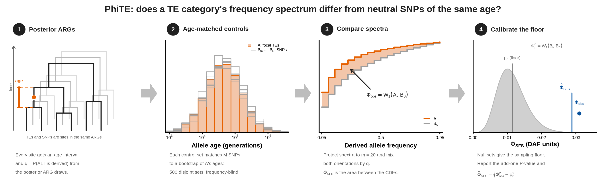

# PhiTE v0.9.0



PhiTE asks whether a focal set of variants, usually a category of transposable
elements (TEs), has a different site-frequency spectrum (SFS) from neutral SNPs of
the same age. It builds SNP control sets matched to the focal set's posterior ages
from an ancestral recombination graph (ARG), then compares unfolded spectra with
the Phi-SFS statistic. The focal set A may be TEs or SNPs (SNP-versus-SNP runs are
negative controls); the controls B are SNPs.

- How the statistic works: [docs/METHODS.md](docs/METHODS.md)
- Every option and launcher variable: [docs/OPTIONS.md](docs/OPTIONS.md)
- Evidence that the pipeline is calibrated: [docs/VALIDATION.md](docs/VALIDATION.md)

A separate pipeline estimates the distribution of derived-allele ages for a
sample: [derived_distribution_readme.md](derived_distribution_readme.md).

## Citation

> Liu, B., Munasinghe, M., Fairbanks, R. A., Hirsch, C. N., and Ross-Ibarra, J. (2025).
> Genome-wide selection on transposable elements in maize. bioRxiv 2025.09.16.676665.
> <https://doi.org/10.1101/2025.09.16.676665>

## Install

On a Linux compute node:

```bash
conda env create -f environment.yml
conda activate normalizeTE
python -m pytest -q tests
```

Run production analyses from a release tag or fixed commit (`git checkout TAG`).

## Inputs

- posterior ARG draws as tszip archives (`*.tsz`);
- position files for all filtered SNPs, all TEs, and the focal category: two
  whitespace-separated columns, chromosome and 1-based VCF position (`#` comments
  allowed);
- a chromosome-offset file, unless every ARG carries compatible chromosome metadata;
- a filtered, genome-wide, biallelic VCF in which every TE is coded as an ACGT site
  with the same alleles as in the ARGs (this dataset uses `A` for absence and `G`
  for presence).

## Configure

```bash
POSTERIOR_DIR=/path/posterior          # *.tsz ARG draws
CHROM_OFFSETS=/path/chrom_offsets.txt
SNP_POSITIONS=/path/snp/all_snp.pos.txt
ALL_TE_POSITIONS=/path/te/all_te.pos.txt
A_POSITIONS=/path/te/in_gene.pos.txt   # the focal category
A_TYPE=TE                              # SNP for a negative control
VCF=/path/variants.vcf.gz

STORE=results/age_interval_store
ANCESTRAL=results/ancestral_states
VCF_ELIGIBILITY=results/vcf_eligibility
CANDIDATES=results/candidate_rows.npy
TARGET=results/targets/in_gene
MATCHES=results/bootstrap_matches/in_gene
WORK_DIR=results/work/in_gene
PHI=results/phi_sfs/in_gene
mkdir -p results/targets results/bootstrap_matches results/work results/phi_sfs
```

Every output path must be new; no tool overwrites an existing result. Run every
step on a compute node, not a login node.

## Run

Steps 1–4 are built once and shared by all categories. Steps 5–6 run per category.

**1. Interval store**: posterior age intervals for every SNP and TE.

```bash
python -m normalize_tes.build_snp_interval_store "$POSTERIOR_DIR"/*.tsz \
  --interval-store "$STORE" --chrom-offsets "$CHROM_OFFSETS" \
  --scratch-dir "${TMPDIR:?}"
```

**2. Ancestral-state table**: the posterior orientation of every site.

```bash
python -m normalize_tes.build_ancestral_states \
  --store "$STORE" --output "$ANCESTRAL" "$POSTERIOR_DIR"/*.tsz
```

**3. VCF eligibility**: callable, ARG-orientable sites, shared by A and B.

```bash
python -m normalize_tes.vcf_eligibility \
  --vcf "$VCF" --store "$STORE" --ancestral-table "$ANCESTRAL" \
  --output "$VCF_ELIGIBILITY"
```

**4. Candidate controls**: filtered SNPs, with every TE and every A site removed.

```bash
python -m normalize_tes.build_candidate_rows \
  --store "$STORE" --include-positions "$SNP_POSITIONS" \
  --exclude-positions "$ALL_TE_POSITIONS" "$A_POSITIONS" \
  --vcf-eligibility "$VCF_ELIGIBILITY" --output "$CANDIDATES" \
  --min-resolved-fraction 0.70
```

**5. Age target and matched controls**: 500 disjoint SNP sets, each matched to a
bootstrap of A's ages.

```bash
python -m normalize_tes.te_age_target \
  --store "$STORE" --te-positions "$A_POSITIONS" -A "$A_TYPE" \
  --vcf-eligibility "$VCF_ELIGIBILITY" --output "$TARGET" \
  --scratch-dir "${TMPDIR:?}" --seed 1002

python -m normalize_tes.bootstrap_target_matcher \
  --store "$STORE" --target "$TARGET" -A "$A_TYPE" \
  --candidate-rows "$CANDIDATES" --output "$MATCHES" \
  --work-dir "$WORK_DIR" --resume \
  --disjoint-replicates --seed 1002
```

Keep `WORK_DIR` on durable storage. After a preemption, rerun the identical command
and the matcher resumes. `--te-positions` takes the focal positions for either type.

**6. Phi-SFS**

```bash
python -m normalize_tes.phi_sfs \
  --target "$TARGET" --matches "$MATCHES" --vcf "$VCF" \
  --ancestral-table "$ANCESTRAL" -A "$A_TYPE" --output "$PHI"
```

The defaults publish 500 sets and require at least 450 QC-passing nulls.

### On Farm

The launchers activate the conda environment and carry the production settings.
Submit them from the repository root:

```bash
# step 2 as an array of 15 parts, then a merge
sbatch --array=0-14 --export=ALL,STORE="$STORE",TREES="$POSTERIOR_DIR/*.tsz",\
OUTPUT=results/ancestral-parts,PER_TASK=5 slurm/run_ancestral_table.sbatch
sbatch --export=ALL,STORE="$STORE",MERGE=1,PARTS="results/ancestral-parts/part-*",\
OUTPUT="$ANCESTRAL",EXPECT_DRAWS=75 slurm/run_ancestral_table.sbatch

# step 5 (builds the target if it does not exist)
sbatch --export=ALL,STORE="$STORE",TARGET="$TARGET",A_POSITIONS="$A_POSITIONS",\
A_TYPE="$A_TYPE",OUTPUT="$MATCHES",CANDIDATE_ROWS="$CANDIDATES",\
WORK_DIR="$WORK_DIR",VCF_ELIGIBILITY="$VCF_ELIGIBILITY",SEED=1002 \
  slurm/run_bootstrap_matching.sbatch

# step 6
sbatch --export=ALL,TARGET="$TARGET",MATCHES="$MATCHES",VCF="$VCF",\
ANCESTRAL="$ANCESTRAL",OUTPUT="$PHI",A_TYPE="$A_TYPE" slurm/run_phi_sfs.sbatch
```

To run many TE categories from one manifest, see
[docs/OPTIONS.md](docs/OPTIONS.md#many-categories). Give each category its own
target, bundle, work directory and seed.

## Read the result

`$PHI/summary.csv` holds one row per run. Report, for each category:

- **effect size**, in DAF units:

  $$
  \hat\Phi_{\mathrm{SFS}}
  =\sqrt{\max\!\left(\Phi_{\mathrm{obs}}^2-\mu_0^2,0\right)}.
  $$

  It is computed from
  `observed_phi_sfs` ($\Phi_{\mathrm{obs}}$) and `null_mean` ($\mu_0$). Raw
  `observed_phi_sfs` includes a finite-sample floor that is larger for smaller
  categories, so it is not comparable across categories on its own. Do not
  subtract `null_mean`: that underestimates real effects by about the floor
  ([docs/PHI_SFS_FLOOR_CORRECTION_W1.md](docs/PHI_SFS_FLOOR_CORRECTION_W1.md));
- `p_value` ($P_A$): one-sided, add-one Monte Carlo. With $R\approx500$ the
  smallest possible value is about 0.002;
- `site_count_m` ($M$) and `null_replicates_r` ($R$). The lowercase suffixes are
  field names; the mathematical symbols are uppercase;
- the CDFs and signed bin residuals (`observed_cdf_residual.npy`,
  `observed_bin_residual.npy`) for the direction of the shift.

`z_score` ($Z_A$) grows with $M$ for the same departure, so it measures test
strength, not effect size; do not plot it or compare it across categories.
Between-category contrasts (`normalize_tes.phi_contrast`) are experimental and
not validated. Report each category separately. See
[docs/METHODS.md](docs/METHODS.md) for definitions and caveats.

## Verify a run

Before using a result:

1. Every `metadata.json` records the expected release, commit and input identities.
2. The candidate report meets `--min-resolved-fraction` and names the intended
   store and eligibility artifact.
3. The target records the intended `a_type` and no `te_polarity` mask.
4. The bundle has 500 sets in disjoint mode, maximum control reuse 1, and the sets
   used by Phi-SFS all pass matching QC.
5. The Phi-SFS result records
   `null_polarity_design=posterior-mixture-vs-posterior-mixture` and equal $M$ for
   A and every set.
6. **The matched sets do not drift with matching order.** Validation covers 500
   sets at $M\approx4{,}000$ only, and a larger category depletes the control pool
   faster. Do not use a category's result until this passes:

   ```bash
   python -m tools.v4_depletion_report --matches "$MATCHES" --phi "$PHI" \
     --min-qc-passes 451 --output results/drift/in_gene
   ```

   Every row of `criteria.csv` must read `True`.

## Outputs

| directory | contents |
|---|---|
| `age_interval_store/` | posterior age intervals and store identity |
| `ancestral_states/` | posterior ancestral-base counts per store row |
| `vcf_eligibility/` | callable, ARG-orientable rows and their orientation probabilities |
| `candidate_rows.npy` + `.json` | control universe and its provenance |
| `targets/CATEGORY/` | focal age target and acceptance threshold |
| `bootstrap_matches/CATEGORY/` | the 500 disjoint control sets, QC and reuse checks |
| `phi_sfs/CATEGORY/` | spectra, CDFs, distances, null Z-scores, `summary.csv`, provenance |

## Repository and further documents

- `normalize_tes/`: the production package (`python -m normalize_tes.COMMAND`).
- `slurm/`: Farm launchers. `tools/`: diagnostics, simulations and validation
  reports. `tests/`: the test suite.
- [docs/BOOTSTRAP_HPC_VALIDATION.md](docs/BOOTSTRAP_HPC_VALIDATION.md): historical
  matcher validation, measured resources and acceptance criteria at the tested
  settings.
- [docs/REMAINING_VALIDATION_PROPOSAL.md](docs/REMAINING_VALIDATION_PROPOSAL.md):
  the frozen v0.9.0 validation plan and its amendments.
- [docs/BOOTSTRAP_TARGET_MATCHING_PLAN.md](docs/BOOTSTRAP_TARGET_MATCHING_PLAN.md),
  [docs/PHI_SFS_WASSERSTEIN_CODING_PLAN.md](docs/PHI_SFS_WASSERSTEIN_CODING_PLAN.md):
  historical matching and Phi-SFS design plans.
- [docs/BOOTSTRAP_DISCARDED_APPROACHES.md](docs/BOOTSTRAP_DISCARDED_APPROACHES.md):
  approaches evaluated and rejected.
- [docs/CODE_REVIEW_ROUND12.md](docs/CODE_REVIEW_ROUND12.md): the latest review.
- [docs/CHANGELOG.md](docs/CHANGELOG.md): release-level changes.

Other plans and older reviews in `docs/` are development history, not instructions.
