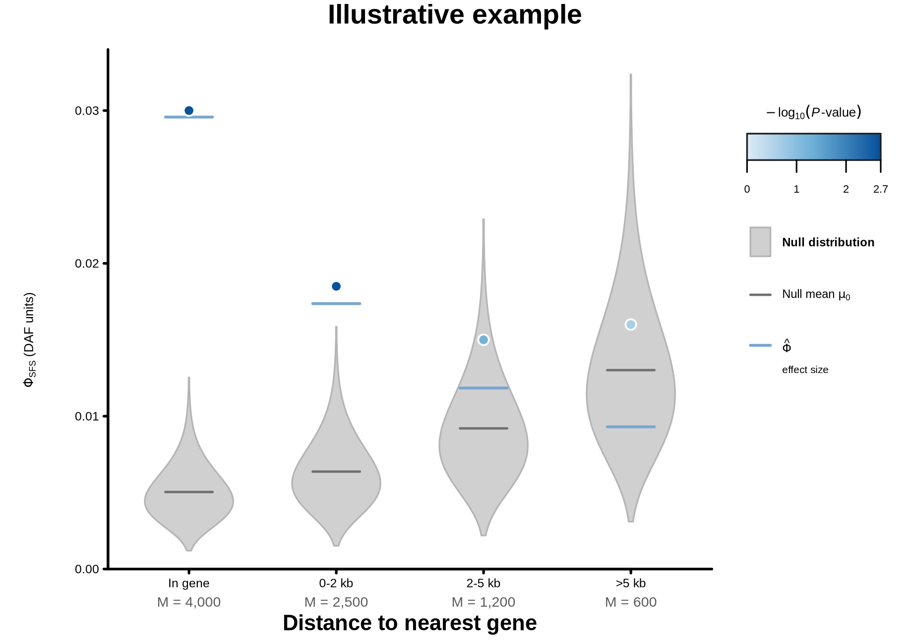

# Phi-SFS methods

This document defines the statistic PhiTE reports, how sites are polarized, and
how the null is calibrated. The operator guide is the [README](../README.md); the
evidence that the design is calibrated is in [VALIDATION.md](VALIDATION.md); the
original implementation plan is in
[PHI_SFS_WASSERSTEIN_CODING_PLAN.md](PHI_SFS_WASSERSTEIN_CODING_PLAN.md).

Notation used throughout:

- $A$ is the focal set, $B_0$ is its reference control set, and $B_i$ is the
  $`i`$th null control set.
- $M$ is the number of sites in each compared set, and $R$ is the number of
  null sets.
- At one site, $n$ is the number of callable inbred genotypes and $k$ is the
  number carrying ALT. Each callable genotype contributes one allele state.
- $m=20$ is the number of callable genotypes in the projected SFS. It is fixed
  across sites and is distinct from the set size $M$.
- $p=k/n$ is the observed ALT frequency, and $q$ is the posterior probability
  that ALT is derived.

## The statistic

Phi-SFS compares the normalized cumulative unfolded SFS of a focal set $A$ with
that of an age-matched neutral SNP set, $B_0$. Let $F_A(x)$ and $F_{B_0}(x)$ be
their CDFs on the derived-allele-frequency (DAF) axis. Then

$$
\Phi_{\mathrm{SFS}}(A,B_0)
= W_1(A,B_0)
= \int_0^1 \left|F_A(x)-F_{B_0}(x)\right|\,dx.
$$

For equally spaced projected DAF bins $x_j=j/m$, this is exactly

$$
\Phi_{\mathrm{SFS}}(A,B_0)
= \frac{1}{m}\sum_{j=1}^{m-1}
  \left|F_A(x_j)-F_{B_0}(x_j)\right|.
$$

Phi-SFS is the area between the two CDFs. It is zero only when the spectra are
identical, and grows as probability mass must move farther along the DAF axis. It
is unsigned: the CDFs and signed bin residuals show whether the focal set has an
excess of rare or high-frequency derived alleles.


## Matched controls

For each control set, the focal set's site ages (from all usable posterior draws)
are resampled with replacement, each site drawn independently and uniformly, and
exactly $M$ SNPs are matched to that bootstrap age CDF. A fresh bootstrap is drawn
for every set. The matcher never looks at allele frequency. Production publishes
500 sets in disjoint mode: once a SNP is used it is removed from the pool, so no
SNP appears in two sets.

The bootstrap resamples focal sites iid, but the matched control sets themselves
are not iid. Disjoint matching draws later sets from a depleted pool, so the sets
are neither independent nor identically distributed. In a 1,001-set run on the
in-gene category ($M=4{,}067$), sets after about 800 drifted away from the
earlier ones; the first 500 did not. Production therefore uses 500 sets, and
every category must pass the drift check in the README before its result is used
(see
[VALIDATION.md](VALIDATION.md#v4-and-v5-production-matching-and-phi-sfs)). A
larger category depletes the pool faster, so its drift may start earlier.

TE targets are built exactly as SNP targets are: ages from all usable posterior
draws, no filter on ARG polarity, and the same eligibility rows. The matcher and
Phi-SFS refuse a target built with a TE polarity mask.

## Polarity: one posterior rule for every site

Every site, TE or SNP, focal or control, is polarized the same way. Define $q$
as the fraction of usable ARG draws in which ALT is derived:

$$
q=\Pr(\mathrm{ALT\ is\ derived}\mid\mathrm{usable\ ARG\ draws}).
$$

The site contributes the posterior mixture of its two orientations,

$$
q\,h_m(k,n)+(1-q)\,h_m(n-k,n).
$$

Here $h_m(k,n)$ is the hypergeometric probability vector for the derived-allele
count after projecting $k$ ALT copies among $n$ callable genotypes to $m$
genotypes. Its component for projected count $j$ is

$$
h_{m,j}(k,n)
=\frac{\binom{k}{j}\binom{n-k}{m-j}}{\binom{n}{m}},
\qquad j=0,\ldots,m.
$$

All $q\in[0,1]$ are kept; there is no polarity filter. ARG draws that cannot
orient either allele are reported as unusable and count toward neither direction.
A TE is an ACGT-coded site in the ARGs like any other, so the same ancestral table
gives its $q$. Where the ARG calls absence derived, the TE contributes at the
absence frequency, just as a SNP whose REF is derived contributes at $1-p$.

**Why TEs are not given their known polarity.** TE presence is biologically the
derived state for a true single insertion, and earlier designs used that: TEs got
a hard insertion-derived spectrum, TEs with under 50% derived support were
dropped, and TE ages came from agreeing draws only. That made the observed
comparison differ in construction from every null comparison. A had true hard
polarity while the nulls carried the ARG's posterior polarity, so any
miscalibration of $q$ entered $\Phi_{\mathrm{obs}}$ and no $\Phi_i^0$
([review 12](CODE_REVIEW_ROUND12.md), findings 1 and 3). In neutral simulations
that construction rejected far above the nominal rate
([VALIDATION.md](VALIDATION.md#polarity-construction)). The cost of the current
rule is that biological knowledge of TE polarity is not used. The test asks
whether TE sites differ from age-matched SNPs as both are seen through the ARG,
not what the TE's true spectrum is, and signal is probably attenuated where the
ARG mis-polarizes TEs.

**Default: posterior mixture throughout.** A, $B_0$ and every null set $B_i$ are
posterior mixtures:

$$
\Phi_{\mathrm{obs}}=\Phi_{\mathrm{SFS}}(A_{\mathrm{mix}},B_{0,\mathrm{mix}}),
\qquad
\Phi_i^0=\Phi_{\mathrm{SFS}}(B_{i,\mathrm{mix}},B_{0,\mathrm{mix}}).
$$

Because the expected projected spectrum is
$q\,h_m(k,n)+(1-q)\,h_m(n-k,n)$, a Bernoulli-$`q`$ hard
spectrum is the mixture plus imputation noise that carries no information about
the data. The mixture avoids that noise and does not depend on an imputation seed.

**Option: Bernoulli-$`q`$ hard orientation** (`--asymmetric-polarity-null`). A and
every $B_i$ are hard-oriented by one Bernoulli-$`q`$ draw per site, and $B_0$ stays a
mixture:
$\Phi_i^0=\Phi_{\mathrm{SFS}}(B_{i,\mathrm{Bernoulli}(q)},B_{0,\mathrm{mix}})$. ALT
is declared derived when a reproducible coordinate-keyed uniform variate is less
than $q$, keyed by `sha256(phi-sfs-bernoulli-q-v1, seed, chromosome, position)`,
so a site gets the same orientation wherever it is used. Results then condition on
one `--polarity-imputation-seed`.

## Null calibration

Finite site counts make the distance positive even under neutrality, so the
sampling floor is calibrated separately for every focal category rather than
comparing raw Phi-SFS values across categories.

1. Apply matching QC. Draw $B_0$ uniformly from the QC-passing sets, with a seed
   derived from `--reference-seed` and the target's seed identity (below). Every
   other QC-passing set is a null, so $R$ is whatever passes QC; production
   requires $R\ge450$.
2. $\Phi_{\mathrm{obs}}=\Phi_{\mathrm{SFS}}(A,B_0)$.
3. $\Phi_i^0=\Phi_{\mathrm{SFS}}(B_i,B_0)$ for $i=1,\ldots,R$. Each $\Phi_i^0$ is
   a raw distance between two neutral SNP sets, not a Z-score.
4. With $\mu_0$ and $s_0$ the mean and sample standard deviation of the
   $\Phi_i^0$,

   ```math
   Z_A=\frac{\Phi_{\mathrm{obs}}-\mu_0}{s_0}.
   ```

5. The one-sided Monte Carlo P-value is

   ```math
   P_A=\frac{1+\sum_{i=1}^{R}
   \mathbf{1}\!\left(\Phi_i^0\ge \Phi_{\mathrm{obs}}\right)}{R+1}.
   ```

The add-one P-value is valid for any $R$. With $R\approx500$ the smallest
attainable value is about $2\times10^{-3}$.

$B_0$ is drawn before any SFS is examined, so the choice of reference is SFS-blind.
Its seed, and every bootstrap and restart seed in the matcher, comes from the
target's **seed identity**: a hash of the focal sites and the target's recorded
inputs (store, eligibility artifact, A type, bin width, bootstrap seed and
settings). It deliberately leaves out the target's floating-point outputs, whose
last digits depend on the thread count and CPU type, so rebuilding a target on
other hardware gives the same sets and the same $B_0$. Bundles from v0.9.0 and
earlier record no seed identity; for them Phi-SFS keeps the earlier rule, which
seeds from the target digest, so their published results still reproduce.
Replicate 0 is not the default reference, because it is matched first, from the
undepleted pool, and so is not a typical set. `--reference-sensitivity N` repeats
the calibration with the next $N$ sets of the same seeded permutation as $B_0$,
which shows how much the result depends on that one draw.

`--max-null-replicates N` instead fixes $R=N$: $B_0$ is the first QC-passing set of
the seeded permutation and the nulls are the next $N$. The negative control uses
$N=99$, which gives an exact P-value grid of 0.01.

## Effect size, P-value and Z-score

**Effect size**, in DAF units:

$$
\hat\Phi_{\mathrm{SFS}}
=\sqrt{\max\left(\Phi_{\mathrm{obs}}^2-\mu_0^2,\,0\right)}.
$$

This estimates the distance between the true spectra. Raw
$\Phi_{\mathrm{obs}}$ is not an effect size on its own: two finite sets drawn from
the same spectrum still have $\Phi>0$, and that floor, $\mu_0$, scales as
$1/\sqrt{M}$, so it is larger for smaller $M$. A small category can therefore
have the largest raw $\Phi_{\mathrm{obs}}$ and the smallest departure.

The floor does not simply add to a real difference, so $\Phi_{\mathrm{obs}}-\mu_0$
is not used. In simulations with a known true distance
([PHI_SFS_FLOOR_CORRECTION_W1.md](PHI_SFS_FLOOR_CORRECTION_W1.md)), subtraction
underestimated every resolvable effect by nearly $\mu_0$; raw
$\Phi_{\mathrm{obs}}$ was unbiased once the effect exceeded about twice the floor
but overestimated smaller effects; and $\hat\Phi_{\mathrm{SFS}}$ stayed within
$+0.4\mu_0$ to $-0.25\mu_0$ of the truth, within 24% for every effect tested at
$M\ge500$. At $M\le250$ no estimate is reliable for effects near the floor.
Those simulations drew sites i.i.d., without matching or depletion. Report
$\hat\Phi_{\mathrm{SFS}}$ with
$\Phi_{\mathrm{obs}}$, $\mu_0$, $M$ and the signed CDF and bin residuals, which give
the direction of the shift.

**P-value**, $P_A$, tests whether the focal spectrum is farther from its matched
neutral background than two finite neutral samples of the same size would be.
It is the significance of the departure, not its size.

**Z-score**, $Z_A$, expresses the departure in null standard deviations. Because
$s_0$ shrinks as $M$ grows, $Z_A$ grows with $M$ for a fixed spectral difference,
so it measures test strength, not effect size. It is kept in `summary.csv` but
should not be plotted or compared across categories.

To plot many categories, use the $\Phi$ scale. For each category, draw its null
distribution of $\Phi_i^0$ in grey, mark $\mu_0$, and draw $\Phi_{\mathrm{obs}}$
as a point coloured by $-\log_{10}P_A$. Mark $\hat\Phi_{\mathrm{SFS}}$ on the
same axis for the effect size. Cap the colour scale at
$\log_{10}(R+1)$, about 2.7 for $R\approx500$.



In this synthetic example, the >5 kb category has a higher raw
$\Phi_{\mathrm{obs}}$ than the 2–5 kb category but the smallest effect
$\hat\Phi_{\mathrm{SFS}}$, and is not significant ($P_A=0.24$), because its
small $M$ gives it the highest floor.

The quadrature correction was first derived for the earlier total-variation
statistic ([PHI_SFS_SAMPLE_SIZE_BIAS.md](PHI_SFS_SAMPLE_SIZE_BIAS.md)); its
validation for $W_1$ is in
[PHI_SFS_FLOOR_CORRECTION_W1.md](PHI_SFS_FLOOR_CORRECTION_W1.md).

## Assumptions and limits

- **Exchangeability.** Drawing $B_0$ at random makes the choice of reference
  uniform among accepted sets. It does not make depleted sets identically
  distributed, and does not show that the $A$-versus-$`B_0`$ comparison is
  exchangeable with the $B_i$-versus-$`B_0`$ comparisons
  ([review 12](CODE_REVIEW_ROUND12.md), finding 7). The negative control, the
  drift check and reference sensitivity together address this
  ([VALIDATION.md](VALIDATION.md)).
- **QC selection.** Matching QC uses only age matching, but age and allele
  frequency are related, so selecting sets on QC is not guaranteed to be neutral
  with respect to their spectra.
- **Linkage.** The focal-age bootstrap resamples sites iid. This adopts the
  Poisson-random-field approximation that local LD averages out for genome-wide
  control pools of millions of SNPs. Revisit it for spatially restricted or
  strongly clustered sets.
- **A is observed once.** The focal set is fixed, so small or unusual focal sets
  can give unstable results even after calibration. Always report $M$, the raw
  distance, null mean and SD, $Z_A$, $P_A$, $R$ and the matching diagnostics.
- **Between-category contrasts are not supported.** `normalize_tes.phi_contrast`
  is experimental: its random pairing of category nulls is not validated and
  ignores covariance between nested or overlapping categories. Report each
  category's result separately; a visual difference between two points is not a
  formal test.
- **Not tested by any validation:** TE genotyping error, recurrent insertion or
  deletion, selection in real TE categories, ARG failure that differs between TE
  and SNP sites, and demography outside the simulated models.

Results use the `phi-sfs-wasserstein-v3` schema and cannot be combined with older
Phi-SFS outputs (see [OPTIONS.md](OPTIONS.md#output-schemas)).
